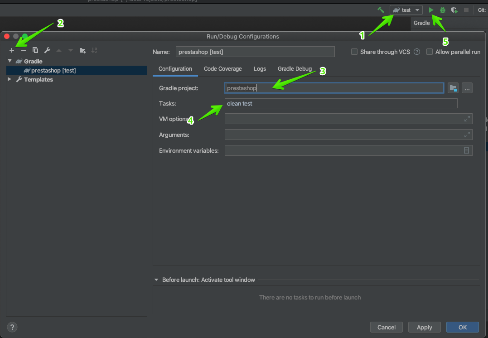

# Gradle project for http://demo.prestashop.com testing
Technologies used: Java/Selenide

## How to start tests from InteliJ IDEA
1. Open build configuration
2. Choose Gradle
3. Choose prestashop project
4. Enter gradle tasks: `clean test`

## How to start tests from command line
1. Execute following command from command line: `gradle cleanTest test`
